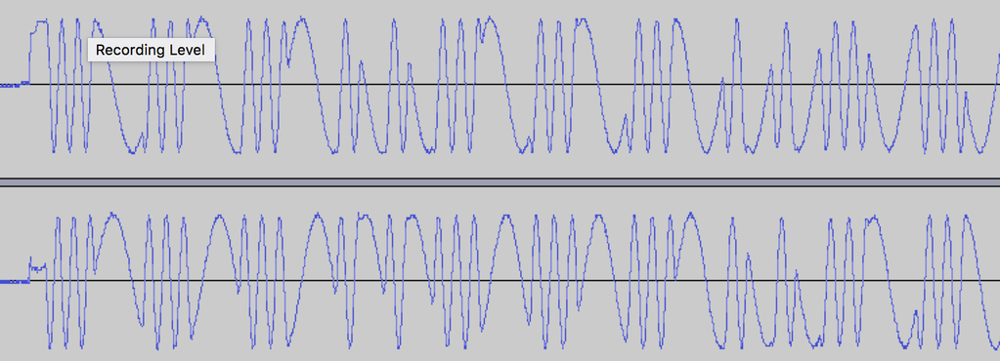

# Decode Omnipod RF Packets


## Prerequisites

* [GNURadio](http://gnuradio.org/), or at least the gnuradio python libraries.
* numpy


## Capturing data

I use [SDR# (SDR Sharp)](http://airspy.com/download/) to capture my iq files, and there are many different ways of doing this. But whatever software you use, you'll need to capture at 2024000 samples per second, and tune your SDR to 433.90MHz.

It should look like this in the end:



Notice that the signal appears to be alternating between two different frequencies. This is [FSK](https://en.wikipedia.org/wiki/Frequency-shift_keying) modulation.  If the signal is too weak (the waves are small), move the pod/pdm closer.  If the waves are clipped at the top, the signal is too strong.

## Running the decoder

```
$ python omni_decode.py find_pdm.wav 
Filename = find_pdm.wav
Using Volk machine: avx_64_mmx
158ms: ffffffffa3ffffffff040607041f01482b037f8d
457ms: ffffffffa3ffffffff040607041f01482b037f8d
756ms: ffffffffa3ffffffff040607041f01482b037f8d
1055ms: ffffffffa3ffffffff040607041f01482b037f8d
1353ms: ffffffffa3ffffffff040607041f01482b037f8d
1652ms: ffffffffa3ffffffff040607041f01482b037f8d
1951ms: ffffffffa3ffffffff040607041f01482b037f8d
2250ms: ffffffffa3ffffffff040607041f01482b037f8d
2549ms: ffffffffa3ffffffff040607041f01482b037f8d
2848ms: ffffffffa3ffffffff040607041f01482b037f8d
3146ms: ffffffffa3ffffffff040607041f01482b037f8d
```
